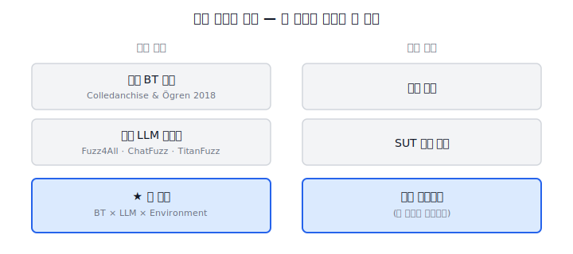
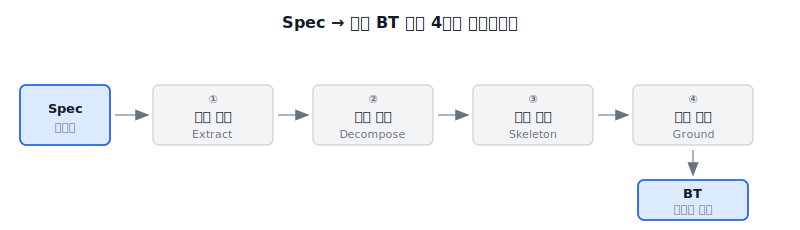

{/* truncate */}

## TL;DR

- SIL의 환경을 Behavior Tree로 두고, LLM으로 생성한다.

## Context

준비했던 논문의 확장은 기여와 평가 방법이 난해하여 기각, 새로 준비하기 위해 생각나는 대로 작성해보았다.

가장 큰 문제가 된 것은 자체 잣대와 프롬프트 엔지니어링 중심, 

## Idea 1
> Behavior Tree를 SIL Test Environment로 두고, LLM을 통해 자동으로 합성한다.
> LLM-based Test를 인증 가능한 형태로 생성한다.

- 문제
	- LLM 기반 테스트(LLM-Fuzz)는 환경을 모델링할 수 없고 재현이 힘들다.
- 해결
	- LLM이 BT를 한 번 합성하고 BT가 결정적으로 실행되어 같은 결과를 내며 재현 가능해진다.
	- 합성의 경우 Spec에서 행위추출하여, 분해하고 골격을 만들어 결합한다.
- 기여
	- BT를 Environment로 쓰는 패러다임을 제시한다.
	- Spec 중심의 테스팅(스크립트 중심)에서 Environment Agent 중심 테스팅으로 전환하여 체계적 절차 없이 확장가능하다.
	- LLM 테스트의 재현 문제와 같은 인증 gap을 분석하여 정량적으로 매핑한다.
- 실험 방법
	- SUT에 동일 방법을 적용(대상은 찾는 중)한다.
	- 비교 방법은 LLM Agent, EvoSuite, Random Testing을 진행할 예정이다.
	- 메트릭은 Spec coverage, mutation score, 결정성 해시 일치율
- 평가 기준
	- 통계 - Arcuri & Briand 2014
	- 커버리지 - IEEE 982.1
	- 인증 매핑 - ISO 26262 Part 6
	- BT 형식론 - Colledanchise & Ögren 2018

