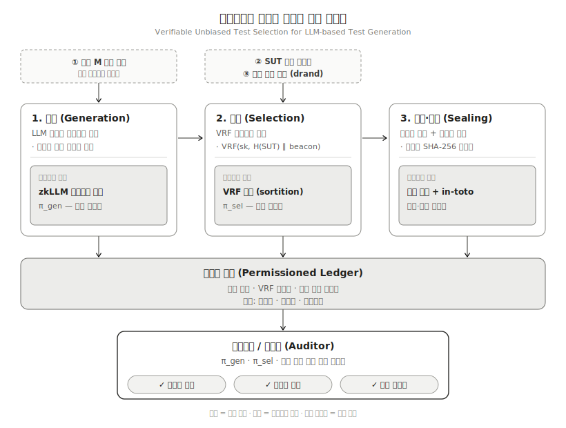

# 블록체인특론 기말고사 대체 과제
> 다음 내용을 포함하는 보고서를 작성하시오.

1. 암호학 및 블록체인 관련 다음 3가지 내용에 대해서 조사하시오(10쪽 내외).
	1. Hash Function
	2. BitCoin Proof-of-Work
	3. Ethereum Proof-of-State
2. 본인이 관심 있는 연구 분야에서 아래 내용으로 작성하시오(10쪽 내외).
	1. 암호학 또는 블록체인을 적용한 관련 연구논문 1개를 선택하여 요약
	2. 본인의 현재 연구주제와 암호학 또는 블록체인은 연관지어 새로운 아이디어 제안
	3. 새로운 아이디어를 표현하는 그림 1개 이상 및 그 설명도 반드시 포함
- 생성형 AI Agent를 적극 활용해 위 보고서를 작성하시오.
	- 제출물
		- 보고서 파일(형식 자유)
		- 사용한 AI Agent 리스트
	- 제출 마감일
		- 6월 23일 오후 10시

## Investigation of Cryptography and Blockchain Technologies

### 해시 함수(Hash Functions)

해시값은 데이터의 디지털 지문에 비유할 수 있다. 사람마다 지문이 고유하듯 어떤 데이터든 짧고 고유한 지문으로 압축되지만, 지문만 가지고 원본을 되돌릴 수는 없다.

#### 암호학적 해시 함수의 정의와 핵심 속성

암호학적 해시 함수는 길이에 상관없이 들어온 입력을 고정 길이의 출력으로 바꾸는 일방향 함수다. SHA 계열은 모두 반복 구조의 일방향 해시(iterative, one-way hash functions)이며, 이 성질 덕분에 메시지가 변조되지 않았는지를 판정하는 용도로 쓸 수 있다. 안전한 해시 함수가 만족해야 하는 성질은 다음과 같다.

- **역상 저항성(Preimage resistance)**: 주어진 해시값 $h$에 대해 $H(m)=h$가 되는 입력 $m$을 찾기가 계산적으로 불가능해야 한다. n비트 출력이라면 약 $2^n$번의 연산이 필요하다.
- **제2역상 저항성(Second preimage resistance)**: 주어진 입력 $m_1$에 대해 $H(m_1)=H(m_2)$를 만족하는 다른 입력 $m_2$를 찾기가 불가능해야 한다.
- **충돌 저항성(Collision resistance)**: $H(m_1)=H(m_2)$인 서로 다른 쌍 $(m_1, m_2)$을 아무거나 찾기가 불가능해야 한다. 다만 생일 역설 때문에 여기에는 약 $2^{(n/2)}$번의 연산만 든다.
- **결정론적(Deterministic)**: 같은 입력은 언제나 같은 출력을 낸다.
- **고정 길이 출력(Fixed-length output)**: 입력 크기와 무관하게 SHA-256은 항상 256비트를 낸다.
- **일방향성(One-way)**: 출력에서 입력을 반대로 계산할 수 없다.
- **효율적 계산**: 어떤 입력에 대해서도 빠르게 계산할 수 있다.

#### 쇄도 효과(Avalanche Effect)

쇄도 효과는 입력이 1비트만 바뀌어도 출력이 절반 가량 뒤집힐 만큼 극적으로 변하는 성질을 말한다. 이 용어는 Horst Feistel이 처음 썼고, 그 뿌리는 Claude Shannon의 확산(diffusion) 원리에 있다. 이를 정량적 기준으로 형식화한 것이 [Webster와 Tavares가 1985년에 제시한 엄격 쇄도 기준(Strict Avalanche Criterion, SAC)](https://link.springer.com/chapter/10.1007/3-540-39799-X_41#citeas)인데, 단일 입력 비트가 반전될 때 각 출력 비트가 정확히 50% 확률로 바뀌어야 한다는 조건이다. 입력이 비슷하더라도 출력은 아무 상관 관계 없는 값이 나오기 때문에, 공격자가 해시 패턴만 보고 원본 정보를 추론할 수 없다. 비슷한 맥락의 기준으로 비트 독립 기준(Bit Independence Criterion, BIC)도 있다.

#### SHA-256 알고리즘 상세

[SHA-256](https://web.archive.org/web/20130526224224/http://csrc.nist.gov/groups/STM/cavp/documents/shs/sha256-384-512.pdf)은 길이가 $2^{64}$비트 미만인 메시지를 256비트 다이제스트로 바꾼다. 블록 크기는 512비트, 워드 크기는 32비트, 출력은 256비트이고, 전처리와 해시 계산의 두 단계로 동작한다.

##### 1. 메시지 패딩(Padding)

길이 l비트의 메시지 $M$을 전체 길이가 512의 배수가 되도록 채운다. 절차는 다음과 같다.

1. 비트 '1'을 하나 붙인다.
2. 512로 나눈 나머지가 448이 되도록 '0'을 $k$개 채운다. 즉 $l+1+k ≡ 448 (\mod 512)$.
3. 마지막 64비트에 원본 길이 $l$을 빅엔디언으로 기록한다.

길이 정보를 패딩에 함께 넣는 이유는 "00"과 "000"처럼 사소한 차이에서 생기는 충돌을 막기 위해서다. 패딩이 끝난 메시지 $M'$은 $N$개의 512비트 블록으로 나뉜다.

##### 2. 초기 해시값($H$)

8개의 32비트 초기 해시값은 처음 8개 소수(2, 3, 5, 7, 11, 13, 17, 19)의 제곱근에서 소수부 첫 32비트를 떼어 온 값이다.

```
H0 = 0x6a09e667   H1 = 0xbb67ae85
H2 = 0x3c6ef372   H3 = 0xa54ff53a
H4 = 0x510e527f   H5 = 0x9b05688c
H6 = 0x1f83d9ab   H7 = 0x5be0cd19
```

##### 3. 라운드 상수($K$)

64개의 32비트 상수 $K[0..63]$는 처음 64개 소수의 세제곱근에서 소수부 첫 32비트를 떼어 온 값이다.

```
K[0]=0x428a2f98, K[1]=0x71374491, K[2]=0xb5c0fbcf, K[3]=0xe9b5dba5,
K[4]=0x3956c25b, K[5]=0x59f111f1, … , K[63]=0xc67178f2
```

소수의 제곱근, 세제곱근처럼 출처가 뻔한 수에서 상수를 뽑는 방식을 nothing-up-my-sleeve라 부르는데, 설계자가 상수에 백도어를 숨기지 않았음을 보이는 표준 관행이다.

##### 4. 메시지 스케줄($W[t]$ 확장, 64워드)

각 512비트 블록은 먼저 16개의 32비트 워드 $W[0..15]$로 쪼개지고, 나머지 48워드는 다음 식으로 확장한다($16 ≤ t ≤ 63$).

```
W[t] = σ1(W[t-2]) + W[t-7] + σ0(W[t-15]) + W[t-16]   (mod 2^32)
```

##### 5. 논리 함수

```
Ch(x,y,z)  = (x AND y) XOR (¬x AND z)        // "Choose": x가 1이면 y, 0이면 z 선택
Maj(x,y,z) = (x AND y) XOR (x AND z) XOR (y AND z)   // "Majority": 다수결
Σ0(x) = ROTR^2(x)  XOR ROTR^13(x) XOR ROTR^22(x)
Σ1(x) = ROTR^6(x)  XOR ROTR^11(x) XOR ROTR^25(x)
σ0(x) = ROTR^7(x)  XOR ROTR^18(x) XOR SHR^3(x)
σ1(x) = ROTR^17(x) XOR ROTR^19(x) XOR SHR^10(x)
```

여기서 `ROTR^n`은 $n$비트 우측 순환 회전, `SHR^n`은 $n$비트 우측 시프트, ⊕는 `XOR`이다.

##### 6. 8개 작업 변수(`a`~`h`)와 64라운드 압축 함수

블록 처리를 시작할 때 작업 변수 `a`, `b`, `c`, `d`, `e`, `f`, `g`, `h`를 직전 해시값 $H0$~$H7$로 초기화한다. 그다음 $t=0$부터 63까지 64라운드를 돈다.

```
T1 = h + Σ1(e) + Ch(e,f,g) + K[t] + W[t]
T2 = Σ0(a) + Maj(a,b,c)
h = g;  g = f;  f = e;  e = d + T1;
d = c;  c = b;  b = a;  a = T1 + T2
```

모든 덧셈은 $2^{32}$ 모듈로 연산이다. 64라운드가 끝나면 각 작업 변수를 직전 해시값에 더한다.

```
H0 += a, H1 += b, …, H7 += h
```

마지막 블록까지 처리한 뒤 $H0$~$H7$을 이어 붙인 256비트가 최종 다이제스트다. 256비트 출력 공간은 약 $1.15×10^{77}(2^{256})$개의 값을 담을 수 있다.

#### 블록체인에서의 해시 함수 활용

- **블록 해싱과 블록 연결**: 각 블록 헤더에는 직전 블록 헤더의 해시(previous block hash)가 들어간다. 그래서 과거 블록을 손대면 그 이후 모든 블록의 해시가 어긋나 변조가 곧바로 드러난다. 이것이 체인이라는 이름의 본질이다.
- **주소 생성**: 공개키를 해시해 주소를 만든다. 비트코인은 SHA-256을 적용한 뒤 RIPEMD-160을 한 번 더 건다.
- **작업증명 퍼즐**: 마이닝은 헤더의 이중 해시를 목표값 아래로 떨어뜨리는 nonce를 찾는 작업이다.

#### 머클 트리와 머클 루트 (Merkle Tree / Merkle Root)

머클 증명은 두꺼운 책의 목차에 비유할 수 있다. 책 전체를 읽지 않아도 목차의 해시 경로만 따라가면 특정 페이지(트랜잭션)가 그 책(블록)에 실려 있는지 확인할 수 있다.

머클 트리(해시 트리)는 여러 데이터 항목을 쌍으로 해싱해 하나의 루트 해시로 압축하는 이진 트리다. 비트코인에서는 다음과 같이 구성된다.

- **리프 노드**: 각 트랜잭션을 이중 SHA-256으로 해싱한 값.
- **내부 노드**: 두 자식 해시를 이어 붙여(concatenate) 다시 해싱한 값.
- **머클 루트**: 트리 최상단의 단일 해시로, 블록 헤더에 기록된다.

트랜잭션이 8개라면 머클 루트는 다음과 같은 모양이 된다.

```
R = H( H(H(T1)||H(T2)) || H(H(T3)||H(T4)) || … )
```

트랜잭션 개수가 홀수이면 마지막 해시를 한 번 복제해 짝수로 맞춘다. 머클 루트는 블록 안 트랜잭션의 정확한 집합과 순서(ordered list)에 대한 구속력 있는 약속(binding commitment)이라서, 리프 두 개의 자리만 바꿔도 보통 루트가 달라진다.

특정 트랜잭션이 블록에 들어 있음을 보이는 **머클 증명**(Merkle Proof, 포함 증명)은, 해당 리프 해시와 루트까지 다시 계산하는 데 필요한 형제(sibling) 해시 $\log_2(N)$개만 제시하면 된다. 예컨대 $T_1$의 포함 증명은 $H(T_2)$, $H(H(T_3)||H(T_4))$, $H(H(H(T_5)||H(T_6))||H(H(T_7)||H(T_8)))$를 넘겨 루트를 재구성한 뒤, 헤더에 적힌 머클 루트와 같은지 확인한다.

증명 크기가 트랜잭션 수에 선형이 아니라 로그($\log_2 N$)로 늘어난다는 점이 핵심 이점이다. 덕분에 경량 클라이언트(SPV, Simplified Payment Verification)는 수백 GB짜리 전체 블록 대신 블록 헤더만(제네시스 이후 전부 합쳐 약 76MB) 들고 있으면서 머클 증명으로 트랜잭션 포함 여부를 확인할 수 있다. 참고로 이더리움은 이를 변형한 머클 패트리샤 트리(Merkle Patricia Tree)를 쓴다.

#### 생일 역설과 생일 공격 (Birthday Paradox / Attack)

생일 역설은 23명만 모여도 생일이 겹치는 두 사람이 있을 확률이 50%를 넘는다는, 직관에 어긋나는 현상이다. 특정 한 사람과 겹쳐야 하는 게 아니라 아무 두 사람만 겹치면 되기 때문이며, 비교 가능한 쌍의 수가 인원의 제곱에 비례한다는 데서 나온다.

이를 해시에 옮기면 이렇게 된다. $n$비트 출력은 $2^n$개의 값을 갖지만, 충돌을 찾는 데는 $2^n$이 아니라 그 제곱근인 약 $2^{(n/2)}$번의 해싱이면 충분하다. 결과적으로,

- 128비트 해시는 충돌에 대해 약 $2^{64}$의 보안만 제공해, 현대 컴퓨팅으로 깨질 수 있다.
- 256비트 해시(SHA-256)는 충돌에 대해 $2^{128}$의 보안을 제공해, 현재는 물론 가까운 미래에도 깨기 어렵다.

충돌 저항을 위해 출력 길이를 두 배로 잡아야 하는 이유가 여기 있다. $2^{128}$ 수준의 공격을 견디려면 256비트 출력이 필요하다. SHA-256은 충돌에 128비트, 역상에 256비트의 보안을 동시에 주는데, 사토시 나카모토가 이 함수를 고른 배경도 흔히 이 균형으로 설명된다. 한편 비둘기집 원리상 무한한 입력을 유한한 출력에 대응시키므로 충돌 자체는 반드시 존재한다. 단지 찾을 수 없을 뿐이다. 실제로 2017년 SHAttered 공격으로 SHA-1의 충돌이 발견되면서 SHA-1은 더 이상 안전하지 않다.

---

### Bitcoin Proof-of-Work

작업증명은 복권 추첨에 비유할 수 있다. 해시를 한 번 시도하는 것은 복권 한 장을 긁는 것과 같고, 해시파워가 클수록 더 많은 복권을 사서 당첨(목표값 미만의 해시) 확률을 높인다. 당첨은 어렵지만, 당첨됐는지 확인하는 것은 누구나 즉시 할 수 있다.

#### 작업증명의 개념과 기원 (Hashcash, Adam Back)

[비트코인 백서](https://bitcoin.org/bitcoin.pdf)는 분산 타임스탬프 서버를 P2P 방식으로 구현하려면 [Adam Back의 Hashcash](http://www.hashcash.org/papers/hashcash.pdf)와 유사한 작업증명 시스템이 필요하다고 밝힌다. Adam Back은 1997년 Hashcash를 고안했고, 2002년 Hashcash - A Denial of Service Counter-Measure 논문으로 정리했다. 애초에 Hashcash는 암호화폐가 아니라 이메일 스팸을 막기 위한 비용 함수였다.

백서의 표현을 빌리면 작업증명은 SHA-256 같은 해시값이 특정 개수의 0비트로 시작하도록 만드는 값을 찾는 작업이다. 요구되는 평균 작업량은 앞에 붙어야 할 0비트 수에 지수적으로 비례하지만, 검증은 단 한 번의 해싱으로 끝난다. 비트코인은 선행 0비트 개수를 세는 대신 해시를 하나의 정수로 보고 목표값보다 작은지를 따지는데, 이렇게 하면 비트 단위보다 더 잘게 난이도를 조절할 수 있다. 백서는 이 구조를 본질적으로 one-CPU-one-vote라고 표현했다.

#### 블록 헤더 구조

비트코인 블록 헤더는 정확히 80바이트이고 6개 필드로 이뤄진다.

|필드|크기|설명|
|---|---|---|
|Version|4바이트|블록 검증 규칙 집합 / 소프트포크 시그널링|
|Previous Block Hash|32바이트|직전 블록 헤더의 이중 SHA-256|
|Merkle Root|32바이트|트랜잭션 머클 트리의 루트|
|Timestamp|4바이트|Unix 시각|
|Bits (nBits/Target)|4바이트|압축 형식의 목표 난이도|
|Nonce|4바이트|마이너가 조정하는 값|

헤더 크기가 80바이트로 고정돼 있는 덕분에 SPV 클라이언트는 전체 블록 없이 헤더 체인만으로 검증을 진행할 수 있다. 제네시스 이후 헤더를 전부 합쳐도 약 76MB인 반면, 전체 블록 데이터는 2026년 중반 기준 약 750GB에 이른다.

#### 마이닝 퍼즐과 이중 SHA-256 (SHA256d)

마이닝은 80바이트 헤더에 이중 SHA-256, 즉 SHA256(SHA256(Block_Header))를 반복해서 걸고 그 결과가 현재 목표값(target)보다 작은지 확인하는 작업이다. 결과가 목표값보다 크면 nonce를 1 늘려 다시 해싱한다. 트랜잭션은 머클 루트를 통해 간접적으로만 해시에 반영되므로, 트랜잭션이 1개든 1만 개든 헤더 해싱 자체의 부담은 똑같다. 이중 해시를 쓰는 것은 길이 확장 공격(length-extension attack)을 막는 등의 이유로 알려져 있다.

#### 난이도와 목표값: bits/nBits 압축 형식

목표값은 256비트짜리 수이지만, 헤더에는 4바이트 bits($n$Bits) 압축 부동소수점 형식으로 저장한다. 예를 들어 packed target `0x1b0404cb`는 첫 바이트(`0x1b`)를 지수로, 나머지 3바이트(`0x0404cb`)를 가수로 보고 복원한다.

난이도 1의 최대 목표값(genesis 블록)은 packed `0x1d00ffff`로 정의되고, 다음과 같이 펼쳐진다.

```
0x00ffff × 2^(8×(0x1d-3)) = 0x00000000FFFF0000000000000000000000000000000000000000000000000000
```

난이도는 `max_target` / `current_target`으로 계산한다. 부호 비트 때문에 하위 24비트가 가질 수 있는 최댓값은 `0x7fffff`다. 해시는 0과 $2^{256}-1$ 사이에서 사실상 무작위로 나오는 수이므로, 목표값이 작을수록(난이도가 높을수록) 유효한 해시를 찾기 어려워진다.

#### 난이도 조정 알고리즘

난이도는 2016블록마다 한 번씩 조정된다. 각 노드는 직전 2016블록의 기대 소요 시간($2016 × 10$분 = 정확히 2주)을 실제 소요 시간으로 나눈다.

- 실제 시간 < 2주(블록이 너무 빨리 생성됨) → 난이도 증가
- 실제 시간 > 2주(너무 느림) → 난이도 감소

급격한 변화를 막기 위해 한 주기당 변동 폭은 최대 4배, 최소 1/4배로 제한한다. 목표로 하는 블록 간격은 평균 10분이며, 이 메커니즘 덕분에 하드웨어 성능이 좋아져도 블록 간격은 일정하게 유지된다.

#### Nonce 공간 소진과 Extranonce

nonce는 4바이트(32비트)뿐이라 조합이 약 43억($2^{32}$) 가지밖에 안 된다. 요즘 ASIC은 이걸 1초도 안 돼 다 써버린다. nonce를 다 소진하면 마이너는 헤더의 다른 필드를 건드려 탐색 공간을 넓혀야 한다.

1. 버전 필드 비트(version rolling, BIP 320)
2. 타임스탬프 일부
3. **extranonce**: 코인베이스 트랜잭션의 scriptSig에 임의 데이터를 넣는 방식. 비트코인 프로토콜에 정식으로 정의된 필드는 아니다.

엑스트라논스를 바꾸면 코인베이스 트랜잭션의 TXID가 바뀌고, 그러면 머클 루트가 바뀌고, 결국 헤더가 바뀌어 nonce 탐색 공간이 사실상 무한히 넓어진다. 마이너는 보통 8바이트짜리 엑스트라논스 공간을 쓰며, 4바이트 nonce와 합쳐 $2^{96}$의 조합을 얻는다.

#### 해시레이트와 네트워크 보안 / 가장 긴 체인 규칙

백서에 따르면 다수결은 가장 긴 체인으로 표현되며, 이는 가장 많은 작업증명이 투입된 체인이다. 정직한 노드가 CPU 파워(지금은 ASIC 해시레이트)의 과반을 쥐고 있는 한 정직한 체인이 가장 빠르게 자란다.

다만 엄밀히 말하면 비트코인은 2010년 7월에 longest chain에서 most-work chain 기준으로 코드를 바꿨다. 판정식이 `pindexNew->nHeight > nBestHeight`에서 `pindexNew->bnChainWork > bnBestChainWork`로 바뀐 것인데, 블록마다 작업량이 다를 수 있기 때문이다. 과거 블록을 변조하려면 그 블록과 이후 모든 블록의 작업증명을 다시 해서 정직한 노드를 따라잡아야 하는데, 백서는 느린 공격자가 따라잡을 확률이 블록이 쌓일수록 지수적으로 떨어짐을 보인다.

#### 51% 공격과 보안 가정

공격자가 전체 해시레이트의 과반을 통제하면 거래를 되돌리거나(이중 지불) 특정 거래를 검열할 수 있다. 다만 남의 코인을 훔치거나 코인을 마음대로 발행할 수는 없다. [Coin Metrics가 2024년 2월 발표한 보고서](https://forklog.com/en/coinmetrics-assesses-the-cost-of-a-51-attack-on-bitcoin-and-ethereum/)에 따르면 비트코인 51% 공격에는 약 700만 개(7 million)의 ASIC 채굴 장비와 약 200억 달러 규모의 자원이 필요하다. 시장에 이만한 ASIC 물량이 없어 사실상 불가능하며, 직접 만든다 해도 비용이 200억 달러를 넘는다. 같은 보고서는 비교 대상으로 이더리움에 대한 34% 공격 비용을 약 343.9억 달러로 산정했다(2023년 12월 31일 기준 ETH $2,279, 스테이킹 2,880만 ETH, 검증자 899,840). 현실적으로는 어떤 행위자도 이 정도 자원을 쓸 경제적 유인이 없고, 네트워크에는 추가 방어 메커니즘도 있다.

#### 블록 보상과 반감기

마이너는 새 블록을 만들면 블록 보상(블록 보조금 + 거래 수수료)을 받는다. 초기 보조금은 50 BTC였고, 210,000블록(약 4년)마다 절반으로 줄어든다.

- 2012년 11월 28일: 50 → 25 BTC
- 2016년 7월 9일: 25 → 12.5 BTC
- 2020년 5월 11일: 12.5 → 6.25 BTC
- **2024년 4월 20일(블록 840,000): 6.25 → 3.125 BTC**
- 2028년 예상(블록 1,050,000): 3.125 → 1.5625 BTC

이로써 일일 신규 발행량은 약 900 BTC에서 약 450 BTC로 줄었다. 총 발행량은 2,100만 개로 묶여 있고, 마지막 비트코인은 약 2140년(블록 약 6,930,000)에 채굴될 것으로 본다. 그 이후로 마이너는 거래 수수료만 받는다. 2024년 반감기 시점에 전체 비트코인의 약 93.75%(약 1,968만 개)가 이미 채굴된 상태였다.

#### 포크와 고아/스테일 블록

두 마이너가 거의 동시에 같은 높이의 유효 블록을 찾으면 일시적인 포크가 생긴다. 양쪽 다 유효한 작업증명을 가지므로, 다음 블록이 어느 쪽에 먼저 쌓이느냐에 따라 누적 작업량이 더 많은 쪽이 정본이 되고 진 블록은 버려진다. 노드는 더 무거운 체인으로 재구성(reorganization, reorg)한다.

용어를 엄밀히 구분하면, 전파 경쟁에서 진 유효 블록은 **스테일(stale) 블록**이고, Bitcoin Core의 좁은 정의에서 **고아(orphan) 블록**은 부모 블록이 알려지지 않은 블록을 가리킨다. 다만 일상적으로는 두 말이 섞여 쓰인다. 비트코인에는 이더리움 PoW의 엉클(uncle/ommer) 보상 같은 장치가 없어서, 버려진 블록의 마이너는 보상을 전부 잃고 그 안의 트랜잭션은 멤풀로 되돌아간다. 거래 확정을 위해 블록을 여러 개 기다리는 6 확인(confirmations) 관행도 이 때문에 생겼다.

#### 에너지 소비 고려사항

작업증명은 실제 전력을 태워 탈중앙 보안을 만든다. Cambridge Bitcoin Electricity Consumption Index(CBECI)를 인용한 [미국 EIA(energy.gov 산하 에너지정보청)에 따르면 2023년 비트코인 마이닝 전력 소비는 67~240 TWh 범위로 추정되며 점 추정치는 120 TWh](https://www.eia.gov/todayinenergy/detail.php?id=61364)다. 2024년 1월 말 전력 수요 추정치는 19.0 GW였고, 하한과 상한은 각각 9.1 GW와 44.0 GW였다. EIA는 같은 자료에서 전 세계 암호화폐 마이닝 전력 사용량이 그리스나 호주의 연간 총 전력 소비와 거의 같다고 설명했고, 미국 내 암호화폐 마이닝은 국가 전력 수요의 0.6~2.3%를 차지한다고 보고했다. 추정 범위가 이렇게 넓은 것은 마이너 활동이 코인 가격에 따라 크게 출렁이기 때문이다.

---

### Ethereum Proof-of-Stake

지분증명은 보증금 담보에 비유할 수 있다. 검증자는 32 ETH를 담보로 맡기고 정직하게 행동하면 이자(보상)를 받지만, 부정행위가 적발되면 담보의 일부나 전부를 몰수(슬래싱)당한다.

#### PoW에서 PoS로의 전환 (The Merge, 2022년 9월)

The Merge는 2022년 9월 15일에 실행돼, 기존 이더리움 메인넷(실행 계층, Execution Layer)을 별도의 지분증명 블록체인인 비콘 체인(Beacon Chain, 합의 계층, Consensus Layer)과 병합했다. 이로써 에너지를 많이 쓰는 마이닝이 사라지고, 스테이킹된 ETH가 네트워크를 지키게 됐다. ethereum.org는 The Merge reduced Ethereum's energy consumption by ~99.95%라고 공식적으로 밝힌다.

#### PoS 핵심 개념: 검증자, 32 ETH 스테이킹, 예치 컨트랙트

검증자(validator)가 되려면 예치 컨트랙트(deposit contract)에 32 ETH를 넣어야 하고, 32 ETH당 검증자 하나가 활성화된다. 32 ETH라는 금액은 노드가 적당한 사양의 하드웨어에서 돌아가도록 정해졌다. 최소 스테이크가 더 낮으면 검증자 수와 슬롯당 처리해야 할 메시지가 늘어 더 강력한 하드웨어가 필요해진다. 노드는 실행 클라이언트, 합의 클라이언트, 검증자 클라이언트의 세 부분으로 구성된다.

프로토콜은 검증자의 임무와 보상을 계산할 때 실제 잔액 대신 **유효 잔액**(effective balance)을 쓴다. ETH 단위로 내림한 값이며, 병합 시점 기준 상한은 32 ETH였다.

#### Gasper 합의 = Casper FFG + LMD-GHOST

이더리움의 합의 메커니즘 [Gasper](https://doi.org/10.48550/arXiv.2003.03052)는 두 요소를 결합한 것이다.

- **LMD-GHOST(포크 선택 규칙)**: Latest Message Driven Greedy Heaviest Observed SubTree의 약자다. 누적 증명(attestation) 가중치가 가장 큰 포크를 정본으로 고르고(greedy heaviest subtree), 한 검증자가 여러 메시지를 보내면 최신 것만 센다(latest-message driven). 슬롯 단위로 체인이 계속 자라게 하는 라이브니스를 담당한다.
- **[Casper FFG](https://arxiv.org/abs/1710.09437)(완결성 가젯)**: Friendly Finality Gadget의 약자다. 선택된 블록을 완결(finalized) 상태로 끌어올려 안전성을 담당한다. 블록 히스토리에 들어간 투표만 세고, 가십으로만 받은 투표는 빼고 센다.

둘의 분업은 이렇다. LMD-GHOST는 블록을 계속 찍어내지만 포크 가능성이 있어 형식적으로 안전하지 않다. 여기에 Casper FFG가 주기적으로 완결성을 얹어 장기적인 되돌림을 막는다. 즉 LMD-GHOST가 라이브니스를, Casper FFG가 안전성을 맡는 구조다. 이더리움은 라이브니스를 우선하기 때문에, Casper FFG가 완결성을 부여하지 못하는 상황에서도 체인은 LMD-GHOST로 계속 자란다. 참고로 Casper FFG는 원래 2017년에 Buterin과 Griffith가 PoW 위에 얹는 오버레이로 설계했지만, 2018년 이후로는 완전 PoS 비콘 체인 아키텍처로 곧장 넘어갔다.

#### 슬롯, 에포크, 위원회

시간은 고정된 단위로 쪼갠다.

- **슬롯(Slot)**: 정확히 12초. 슬롯마다 블록 하나를 만들 기회가 있다(빈 슬롯도 가능).
- **에포크(Epoch)**: 32슬롯 = 6.4분.
- **위원회(Committee)**: 슬롯마다 검증자들이 위원회 단위로 무작위 분할되며, 보안을 위해 위원회 하나는 최소 128명의 검증자로 구성된다. 공격자가 한 위원회의 2/3를 통제할 확률은 1조분의 1보다 작다. 전체 활성 검증자 집합은 에포크마다 RANDAO 시드로 섞여, 모든 검증자가 에포크당 정확히 한 번 증명하게 된다. 위원회로 나누는 이유는 네트워크 부하를 감당 가능한 수준으로 유지하기 위해서다.

#### 블록 제안자(RANDAO로 선택)와 증명(Attestation)

슬롯마다 단일 블록 제안자가 RANDAO 알고리즘으로 의사난수적으로 뽑힌다. 뽑힐 확률은 검증자의 유효 잔액(effective balance, 병합 시점 기준 최대 32 ETH)에 비례한다. 블록 제안자는 RANDAO 기여값을 현재 에포크 번호에 BLS 서명해서 만드는데, 이 값은 예측은 불가능하지만 검증은 가능해야 한다. RANDAO 값은 XOR로 누적되며 에포크마다 갱신된다. 각 에포크의 위원회, 제안자 배정에 쓰이는 시드는 두 에포크 전의 RANDAO 값에서 파생되므로, 검증자 임무는 대략 한 에포크 앞서 확정된다(`MIN_SEED_LOOKAHEAD = 1`).

포크 선택 알고리즘은 누적 증명 가중치가 가장 큰 블록을 부모로 삼고, 그 위에 제안자가 새 블록을 올린다. 블록 본문(`BeaconBlockBody`)에는 `randao_reveal`, `eth1_data`, `proposer_slashings`, `attester_slashings`, `attestations`, `deposits`, `voluntary_exits`, `sync_aggregate`, `execution_payload` 등이 담긴다.

증명(attestation)은 검증자가 서명한 투표로, 두 가지를 담는다. 하나는 체인 머리(head)로 보는 블록에 대한 투표이고, 다른 하나는 정착됐다고 보는 체크포인트(source/target)에 대한 투표다. BLS 서명 집계(aggregation)로 여러 검증자의 서명을 하나로 합쳐 블록에 저장함으로써 통신, 저장 부하를 줄인다. 아발란치(avalanche) 공격을 막기 위해, 슬롯 초반에 제안된 블록에 가중치를 더해 주는 proposer boost가 LMD-GHOST에 추가됐다.

#### 체크포인트, 정당화, 완결화

각 에포크의 첫 슬롯 블록이 **체크포인트**(checkpoint)다. 완결화는 다음 과정을 거친다.

- 한 쌍의 체크포인트(source, target)가 전체 스테이킹 ETH의 2/3 이상(supermajority link)에게서 투표를 받으면, 더 최근 체크포인트(target)가 정당화(justified)된다.
- 그러면 이미 정당화돼 있던 이전 체크포인트가 완결화(finalized)로 승격된다.

정당화된 체크포인트는 드물게 바뀔 수 있지만, 완결화된 체크포인트는 영구적인 것으로 취급한다. 트랜잭션은 보통 두 에포크(약 12.8분) 뒤에 완결된다. 2/3라는 문턱이 필요한 이유는, 충돌하는 두 포크가 모두 2/3 투표를 받으려면 최소 1/3이 양쪽에 투표(위반)해야 하기 때문이다.

#### 완결성: 경제적 완결성

이더리움의 완결성은 암호경제적(crypto-economic) 완결성으로, 작업증명의 확률적(probabilistic) 완결성과 대비된다. PoW에서는 블록이 오래될수록 되돌릴 확률이 점점 낮아질 뿐 명시적인 완결 상태가 없어서, 사용자가 스스로 이 정도면 안전하다고 판단한다. PoS에서는 완결된 블록을 되돌리려면 공격자가 전체 스테이킹 ETH의 최소 1/3을 소각해야 한다. 수백억 달러가 드는 일이라 사실상 불가능하다.

#### 보상과 벌칙

모든 보상과 벌칙은 에포크마다 한 번 적용된다. 보상은 `base_reward`를 기준으로 하며, base reward per increment는 전체 활성 잔액의 제곱근에 반비례한다. 따라서 검증자가 늘수록 1인당 보상은 $\sqrt N$에 반비례해 줄어든다.

```
base_reward_per_increment = EFFECTIVE_BALANCE_INCREMENT(1 ETH) × BASE_REWARD_FACTOR(64) ÷ √(전체 활성 잔액)
base_reward = (검증자 유효잔액 ÷ 1 ETH) × base_reward_per_increment
```

- **증명 보상(Attestation rewards)**: Altair 업그레이드 이후 검증자의 증명 보상은 세 가지 적시(timely) 플래그 가중치로 나뉜다. 가중치의 합은 `WEIGHT_DENOMINATOR(64)`와 같다(ethereum/consensus-specs 기준).
    
    - T`IMELY_SOURCE_WEIGHT` = 14
    - `TIMELY_TARGET_WEIGHT` = 26
    - `TIMELY_HEAD_WEIGHT` = 14
    - `SYNC_REWARD_WEIGHT` = 2 (싱크 위원회)
    - `PROPOSER_WEIGHT` = 8
    - (합 = 64)
    
    증명이 빨리 포함될수록 보상이 크다. 제안 후 한 슬롯 안에 포함되면 최대 보상(`base_reward` × 1/`delay`)을 받는다.
    
- **제안자 보상(Proposer rewards)**: 제안자는 자신이 포함한 증명에서 나오는 보상의 일부를 받는데, 그 비율은 `PROPOSER_WEIGHT` / (`WEIGHT_DENOMINATOR` − `PROPOSER_WEIGHT`) = $8/56$ = $1/7$이다. 또한 다른 검증자의 위반 증거(슬래싱)를 포함하면 추가 보상을 받는다. 내부고발자 보상은 슬래싱당한 검증자의 유효잔액 ÷ `WHISTLEBLOWER_REWARD_QUOTIENT(512)`이고, 제안자는 그중 `PROPOSER_WEIGHT/WEIGHT_DENOMINATOR` = $1/8$을 가져간다.
    
- **비활동 누출(Inactivity leak)**: 합의 계층이 4 에포크(`MIN_EPOCHS_TO_INACTIVITY_PENALTY`)를 넘겨도 완결성에 실패하면 비상 프로토콜인 비활동 누출이 작동한다. 다수에 반하거나 오프라인인 검증자의 스테이크를 2차 함수적으로 점점 깎아, 온라인 검증자가 다시 2/3 다수를 회복해 체인을 완결할 수 있게 만든다. 네트워크 분할 상황에서 안전성과 라이브니스를 함께 되살리는 자가 치유(self-healing) 장치다. `INACTIVITY_PENALTY_QUOTIENT`는 Bellatrix(병합) 기준 $2^{24} = 16,777,216$이다.
    
- **슬래싱(Slashing) 조건 — Casper 계명(Commandments) 위반**: Casper FFG에는 두 가지 최소 슬래싱 조건, 이른바 [Casper 계명](https://doi.org/10.48550/arXiv.1710.09437)이 있다.
    
    1. 검증자는 같은 target 높이에 대해 서로 다른 두 투표를 내서는 안 된다(**이중 투표, double voting**).
    2. 검증자는 자기 다른 투표의 범위(span) 안에 투표해서는 안 된다(**둘러싸기 투표, surround voting**), 즉 $h(s_1) < h(s_2) < h(t_2) < h(t_1)$인 경우.
    
    이를 어기거나 같은 슬롯에 블록을 두 개 제안(equivocation)하면 슬래싱된다. 즉시 일부(32 ETH 검증자 기준 effective balance ÷ `MIN_SLASHING_PENALTY_QUOTIENT`)가 소각되고 36일짜리 제거 기간이 시작되며, 18일째에는 같은 시기에 함께 슬래싱된 정도에 비례하는 **상관 벌칙**(correlation penalty)이 매겨진다. 위반 검증자가 많을수록(즉 공모할수록) 벌칙이 커져 최대 전체 스테이크를 잃을 수 있다.
    
    Casper의 핵심 속성인 **책임 있는 안전성**(accountable safety)은 이렇다. 충돌하는 두 체크포인트가 모두 완결되려면 최소 1/3의 검증자가 슬래싱 조건을 어겨야 하고, 따라서 전체 스테이크의 최소 1/3이 소각된다.
    

#### 검증자 생명주기: 활성화 큐, 퇴장 큐, 인출

- **활성화/퇴장 큐와 처닝(churn)**: 검증자가 너무 빨리 들고 나면 합의가 불안정해지므로 에포크당 처리량을 제한한다. 처닝 한도(churn limit)는 활성 검증자 수에 따라 정해졌고(과거 공식 max(4, $⌊$`active_validators`$/65536⌋$)), 활성 검증자가 65,536명 늘 때마다 1씩 커졌다. 2024년 1분기 Dencun 업그레이드의 EIP-7514로 활성화 처닝 한도에 최대 8이라는 상한이 생겼다(에포크당 약 8명, 하루 약 1,800명, 약 57,600 ETH).
- **활성화 지연**: 신규 검증자는 RANDAO 조작을 막기 위해 활성화 전 최소 4 에포크를 기다린다.
- **인출(Withdrawals)**: 2023년 4월 Shanghai/Capella(Shapella) 업그레이드(EIP-4895)로 스테이킹 인출이 가능해졌다. 부분 인출(32 ETH 초과 보상)은 자동 스윕(sweep)으로 처리되고, 전체 인출(원금 포함)은 자발적 퇴장 뒤에 처리된다. 퇴장 후 약 27시간(256 에포크)의 인출 가능 지연이 있다. 자발적 퇴장은 최소 256 에포크(`shard_committee_period`)를 복무한 뒤에 신청할 수 있다.
- **슬래싱된 검증자**: 약 36일(8,192 에포크)의 제거 기간을 거친다.

#### RANDAO와 무작위성

블록체인에는 진짜 무작위성이 없다. 각 노드가 제멋대로 난수를 만들면 합의가 불가능하기 때문이다. 그래서 RANDAO는 예측은 불가능하되 검증은 가능한 의사난수를 만든다. 각 제안자가 현재 에포크 번호에 BLS 서명한 값을 기존 RANDAO에 XOR로 섞는 방식이다. 제안자가 할 수 있는 일은 정해진 단일 값을 기여하거나 블록을 건너뛰는 것뿐이라, 무작위성을 조작할 여지가 매우 좁다. 진입과 퇴장을 4 에포크(`MAX_SEED_LOOKAHEAD`) 지연시켜 조작을 한 번 더 무력화한다. RANDAO 조작 공격(stake grinding)을 하려면 대략 전체 스테이크의 절반이 필요하다. 비콘 상태는 과거 RANDAO 값(`randao_mixes`)도 저장해 두기 때문에, 몇 달 뒤에도 과거 증명을 슬래싱할 수 있다.

#### 보안: Nothing at Stake 문제와 PoS의 해결

Nothing at stake 문제는, 보상만 있고 벌칙이 없는 일부 PoS에서 실용적인 검증자가 보상을 극대화하려고 모든(또는 여러) 포크에 동시에 투표하려는 유인이 생기는 개념적 문제다. PoW에서는 두 체인을 동시에 채굴하려면 해시파워를 쪼개야 하므로 비용이 들지만, PoS에서는 블록을 만드는 데 비용이 없어 보인다.

이더리움은 **슬래싱과 완결성 조건**으로 이 문제를 푼다. 충돌하는 포크에 투표하면(이중, 둘러싸기 투표) 슬래싱돼 스테이크를 잃으므로, 하나의 정본 체인에만 투표할 경제적 유인이 생긴다.

공격 비용은 이렇다. 완결성을 되돌리려면 1/3 스테이크를 소각해야 하고, 정본 체인을 검열하려면 1/3 스테이크로 완결을 방해할 수 있다. 단기(short-range) 공격은 공격자가 정본 체인에 슬래싱 가능한 스테이크를 들고 있어야 하므로 비용이 크다. 최악의 경우 커뮤니티는 사회적 슬래싱(social slashing)으로 정직한 체인을 포크해 복구할 수 있다.

#### 약한 주관성(Weak Subjectivity)

PoS 특유의 장거리 공격(long-range attack)은, 과거에 스테이크를 인출한 검증자들이 역사적 시점부터 경쟁 포크를 만들어 오래 오프라인이던 새 노드를 속이는 공격이다. 이미 스테이크를 빼서 슬래싱 위험이 없다는 점을 노린다.

이더리움은 **약한 주관성 체크포인트**(weak subjectivity checkpoint)로 이를 막는다. 2014년 Buterin이 도입한 개념([Proof of Stake: How I Learned to Love Weak Subjectivity](https://blog.ethereum.org/2014/11/25/proof-stake-learned-love-weak-subjectivity))으로, 새로 들어오거나 오래 오프라인이던 노드는 믿을 만한 최근 상태(state root)를 다른 노드나 블록 익스플로러, 공개 엔드포인트 같은 출처에서 받아 유사 제네시스 블록으로 삼는다. 노드는 이 체크포인트 이전으로는 재구성(revert)하지 않으므로, 장거리 포크는 프로토콜 정의상 무효가 된다. 약한 주관성 체크포인트의 간격은 검증자 인출 기간보다 짧게 잡혀, 포크를 만든 검증자가 스테이크를 빼기 전에 슬래싱될 수 있도록 보장한다. 제네시스부터 신뢰 없이 동기화할 수 있는 PoW와 철학적으로 다른, 최소한의 사회적 신뢰 가정이다.

#### PoW 대비 에너지 사용 (~99.95% 감소)

The Merge로 이더리움 에너지 소비는 약 99.95% 줄었다. ethereum.org는 The Merge reduced Ethereum's energy consumption by ~99.95%라고 밝히는데, 이는 Ethereum Foundation의 사전 추정치다. [사후 측정인 CCRI(Crypto Carbon Ratings Institute, Consensys 의뢰) 보고서는 99.988% 이상 감소(연 약 2,300만 MWh에서 약 2,600 MWh로)를 확인](https://ethereum.org/energy-consumption/)했고, CO2 배출은 99.992% 감소(연 1,100만 톤 초과 → 870톤 미만)했다고 밝혔다. EY의 한 분석은 단일 거래의 탄소 발자국이 109.71 kg에서 0.01 kg으로 줄었다고 보고했다(2022년 9월 20일 측정). 종합하면 PoS는 PoW보다 약 2,000배 에너지 효율적이다.

#### 최신 업데이트: Pectra (2025년 5월)

2025년 5월 7일 Pectra(Prague 실행계층 + Electra 합의계층) 업그레이드가 메인넷에 활성화됐다. 핵심 변화인 [EIP-7251](https://eips.ethereum.org/EIPS/eip-7251)은 검증자의 최대 유효 잔액을 32 ETH에서 2,048 ETH로 올려(최소 32 ETH는 유지) 대규모 스테이커가 검증자를 통합하고 보상을 복리로 굴릴 수 있게 했다. 이 밖에 [EIP-7002](https://eips.ethereum.org/EIPS/eip-7002)(실행계층에서 트리거하는 인출), [EIP-6110](https://eips.ethereum.org/EIPS/eip-6110)(예치 지연을 약 12시간에서 약 13분으로 단축), [EIP-7702](https://eips.ethereum.org/EIPS/eip-7702)(EOA의 스마트 계정화) 등 모두 11개 EIP가 포함됐다. Pectra 이후로 처닝은 검증자 수가 아니라 ETH 총량 기준(에포크당 최대 256 ETH 등)으로 계산된다.

## Software Testing with Cryptography and Blockchain

생성형 AI가 떠오르면서, 거대 언어 모델(LLM)로 테스트 케이스, 입력, 시나리오를 대량 생성하는 LLM 기반 테스트 생성이 이 분야의 주된 흐름으로 자리 잡았다. 사람이 일일이 쓰던 테스트 산출물을 모델이 대량으로 합성하면서, 테스팅의 병목은 테스트를 어떻게 만들 것인가에서 그렇게 만든 테스트를 어떻게 신뢰할 것인가로 옮겨가고 있다.

이 신뢰 문제는 세 갈래로 나눌 수 있다. 첫째는 생성의 진정성이다. 어떤 산출물이 정말 특정 모델에서 나온 것인지, 사후에 위조되거나 교체되지 않았는지의 문제다. 둘째는 선택의 무결성이다. 모델이 쏟아낸 방대한 테스트 가운데 무엇을 실제로 실행할지를 고르는 자유도가 통제되지 않는다는 문제로, 검증 주체가 자기에게 유리한, 즉 통과가 보장된 테스트만 골라 돌리는 체리피킹이 여기 해당한다. 셋째는 실행 및 결과의 무결성과 감사 가능성이다. 선택된 테스트가 실제로 어떻게 실행돼 어떤 판정을 받았는지, 그리고 그 기록을 서로 믿지 않는 다자(개발사, 검증사, 인증기관)가 어떻게 공유하고 검증할지의 문제다.

암호학과 블록체인은 이 세 문제에 각각 대응하는 도구를 준다. 해시 함수와 머클 트리는 산출물의 무결성과 재현성을, 검증 가능 난수 함수(Verifiable Random Function, VRF)는 선택의 조작 불가능성을, 영지식(Zero-Knowledge) 증명은 계산의 진정성을, 분산 원장은 다자 간 변경 불가능한 공유 이력을 보장한다. 이 도구들이 전부 블록체인을 요구하는 것은 아니다. 어떤 부분이 암호학만으로 충분하고 어떤 부분이 분산 원장을 필요로 하는지 구분해, 소프트웨어 테스팅과 연결한 아이디어를 제안하려 한다.

### Cryptography and Blockchain Applications in Software Testing

소프트웨어 테스팅에 암호학과 블록체인을 적용한 연구는 대략 세 갈래다. 첫째는 파이프라인 무결성 계열이다. Torres-Arias 등의 [in-toto](https://dl.acm.org/doi/10.1145/3423211.3425674)는 소프트웨어 공급망의 각 단계(개발→빌드→CI/CD 테스트→패키징→배포)가 미리 정의한 틀대로 정직하게 수행됐음을, 단계별 링크 메타데이터라는 암호학적 증명으로 보장한다. 둘째는 테스트 협업, 결과 기록 계열로, [테스트 활동과 결과를 변경 불가능한 원장에 기록해 다자 추적성과 보상 공정성을 확보하려는 시도](https://doi.org/10.48550/arXiv.2307.07212)다. 셋째는 계산 진정성 계열로, 검증에 쓴 계산 자체가 정직하게 수행됐음을 암호학적으로 증명하는 방향이다.

테스트 기록을 위변조 불가능하게 남기는 일은 블록체인 없이도 가능하다. 서명된 추가 전용 투명성 로그(append-only transparency log)만으로도 변조 탐지와 감사가 되기 때문이다. 블록체인의 합의가 실질적인 가치를 더하는 경우는, 믿을 만한 중앙자가 없고 서로 불신하는 다자가 존재할 때로 한정된다. 따라서 테스팅에 블록체인을 접목한다는 제안은 그 다자 불신이 실제로 존재하는지를 먼저 입증해야 하며, 그렇지 않다면 암호학적 로그가 더 단순하고 적절한 해법이라고 본다. 이 보고서는 이 비판을 제안의 전제로 받아들이고 작성했다.

#### [zkLLM](https://doi.org/10.1145/3658644.3670334)

LLM의 영향력이 커지면서 그 출력의 정당성을 둘러싼 법적, 제도적 요구도 늘고 있지만, 모델 파라미터는 보통 지식재산으로 다뤄져 직접 공개하거나 검사할 수 없다. 그래서 특정 출력이 정말 특정 모델에서 나왔음을, 파라미터를 드러내지 않고 입증해야 하는 근본적 과제가 생긴다. zkLLM 저자들이 드는 동기 사례는, 규제 기관이 개발자에게 지정한 프롬프트로 추론을 시켜 모델의 진정성을 검증하되, 개발자는 파라미터를 노출하지 않고 출력의 진정성만 증명하려는 상황이다.

zkLLM은 트랜스포머 구조 LLM의 추론에 영지식 증명(ZKP)을 적용한 검증 가능 추론 기법이다. 핵심 난점은 어텐션 메커니즘에 두루 쓰이는 Softmax 같은 비산술 연산을 영지식 회로에서 다루는 것인데, 저자들은 이를 위해 어텐션 전용 증명 구성 요소인 zkAttn을 설계하고 비산술 연산을 Lookup Argument로 처리한다. 또한 딥러닝의 병렬 연산 자원에 맞춘 CUDA 구현으로 증명 생성을 가속한다.

zkLLM은 13B 파라미터 규모의 LLM에 영지식 검증 가능성을 제공한 최초의 연구로, 전체 추론 과정에 대한 정확성 증명을 15분 이내에 생성하고, 증명 크기는 200KB 미만이며, 그 과정에서 모델 파라미터의 프라이버시가 보존된다. LLM 추론이라는 대규모 비선형 계산에 대해 실용적인 수준의 검증 가능성을 달성했다는 점에서 의의가 있다.

다만 zkLLM이 보장하는 것은 생성 단계의 진정성이다. LLM이 만든 산출물이 위조나 사후 조작 없이 약속된 모델에서 나왔음을 검증하게 해 주며, 이는 비결정적 LLM을 안전 인증 파이프라인에 편입할 때 반드시 필요한 보증이다.

그러나 zkLLM은 테스트 캠페인 전체의 신뢰 문제 가운데 생성 단계 하나만 다룬다. 선택과 실행, 결과의 무결성과 다자 신뢰는 공백으로 남는다. 생성된 수많은 시나리오 중 어떤 부분집합을 실제 검증에 쓸지에 대한 자유도가 통제되지 않으며, 검증 주체가 자기에게 유리한 시나리오만 고르는 체리피킹을 구조적으로 막지 못한다. 추론 결과의 진정성은 보장하지만, 그 산출물이 어떻게 실행돼 어떤 오라클 판정을 받았는지, 그리고 그 전체 기록을 서로 불신하는 다자가 어떻게 공유하고 감사할지는 다루지 않는다.

### Advancing Software Testing via Cryptography/Blockchain

LLM이나 퍼저로 테스트를 대량 생성하는 환경에서는 생성보다 선택이 더 미묘한 신뢰 문제를 만든다. 후보가 수천 개여도 일부만 실행할 수밖에 없는데, 그 부분집합을 누가 어떻게 고르느냐에 따라 결과가 크게 달라지기 때문이다. 검증 주체가 통과하기 쉬운 테스트만 골라 돌리면 검증을 통과했다는 주장은 사실상 무의미해진다. 이 선택 편향 혹은 체리피킹은 LLM이든 자율주행이든 특정 도구든 무관하게, 무작위 및 대량 테스트 생성이라는 패러다임 자체에 내재한 일반적 문제다.

테스트 선택에 무작위성이 끼어들 때, 결함 테스트 문헌은 무작위성을 다루는 두 방식이 모두 불완전함을 보여 준다. [난수 시드를 고정하면 재현은 되지만 하나의 실행 경로에 갇혀 다른 시드에서 드러날 결함을 놓치고](https://doi.org/10.1145/3395363.3397366), 시드를 무작위로 두면 커버리지는 얻지만 재현이 안 되고 조작도 가능하다. 즉 재현성, 커버리지, 조작 저항성은 동시에 만족시키기 어려운 트레이드오프다.

VRF는 이 셋을 함께 만족시키기에 특히 잘 맞는 암호 함수다. VRF의 출력은 비밀키 보유자에게는 결정적이고 재현 가능하면서도, 예측 불가능하고 조작 불가능하며, 공개키로 누구나 검증할 수 있다. 바로 이 성질을 살려 [Algorand는 VRF 기반 Cryptographic Sortition으로 합의 위원회를 비공개, 비대화식, 예측불가, 표적불가하게 선출했다](https://doi.org/10.1145/3132747.3132757). 대조적으로 이더리움 PoS의 RANDAO는 마지막 기여자가 제출 여부로 결과를 비틀 수 있는 약점이 있는데, 이는 선택을 유리하게 비트는 체리피킹과 구조적으로 같은 문제다. 이 제안은 Algorand가 위원을 뽑는 방식과 비슷하게 테스트를 선출한다.

LLM 기반 테스트 생성 파이프라인에 단계별 암호학적 봉인을 결합해, 재현 가능하고 위변조 불가능하며 선택 편향이 제거된 테스트 캠페인을 구성한다. 세 단계는 다음과 같다.

1. **생성**: LLM이 테스트 산출물을 생성하면, zkLLM식 검증 가능 추론으로 이 산출물은 커밋된 모델이 생성했다는 증명 π_gen을 붙인다. 완전한 검증 가능 추론의 비용이 부담스러우면 모델 가중치 해시 커밋과 서명으로 가볍게 대체할 수 있으며, zkLLM은 완전한 진정성이 필요할 때의 상한선으로 인용, 활용한다.
    
2. **선택**: 생성된 후보를 미리 머클 트리로 커밋한 공개 카탈로그(pre-committed catalog)로 고정한다. 그다음 공개 난수 비콘(예: drand처럼 임계 BLS 서명으로 구현된 분산 난수 비콘)의 값과 대상 시스템 해시를 입력으로 VRF를 평가해 실행할 부분집합을 정하고 증명 π_sel을 남긴다. 입력을 $VRF(sk, H(SUT)||beacon)$ 형태로 묶고, 대상을 먼저 커밋한 뒤 비콘이 공개되는 commit-then-reveal 순서를 강제한다. 그러면 검증 주체는 선택 결과를 미리 알 수도(비콘이 미래값), 입력을 갈아끼워 유리한 시드를 캘 수도(대상이 선커밋) 없다. 이로써 grinding 형태의 체리피킹은 암호학적으로 차단되고, 선택은 누구나 재현, 검증할 수 있다. 다만 VRF는 균등 추출을 강제하지 않고 사전 커밋된 카탈로그 위에서 예측 불가능한 추출의 시드만 제공하므로, 가중, 커버리지 지향 시나리오 설계 방법론은 그대로 보존된다.
    
3. **실행 및 봉인**: 선택된 테스트를 실행하고 오라클로 판정한 뒤, 산출물 전체(테스트 명세, 환경 설정, 실행 로그, 오라클 결과, π_gen, π_sel)를 SHA-256으로 콘텐츠 주소화하고 캠페인 단위 머클 트리로 집계해 하나의 머클 루트로 봉인한다. in-toto식 단계별 attestation으로 각 단계의 수행 사실을 증명한다.
    

블록체인은 서로 불신하는 다자가 변경 불가능한 공유 이력을 가져야 하는 경계에만 쓴다. 캠페인의 머클 루트, VRF 공개키, 모델 커밋을 개발사, 검증사, 인증기관이 노드로 참여하는 허가형 원장에 앵커링한다. 믿을 수 있는 단일 인증기관만 있으면 앞서 논한 투명성 로그로 충분하므로, 원장은 다자 불신이 실재할 때만 도입한다.

이 제안은 정량적 우위가 아니라 실현 가능성의 제안이며, 다음과 같은 한계가 있다.

- **선택의 정확성이 아니라 무선택성 보장**: VRF는 선택이 조작되지 않았음을 증명하지만, 안전상 중요한 코너 케이스가 그 선택에 들어 있음을 보장하지는 않는다. 잘못 설계된 카탈로그 위에서는 검증 가능하게 잘못된 것을 테스트한 결과가 나올 수 있어, 카탈로그의 대표성과 커버리지 설계는 이 제안의 외부 의존성으로 남는다.
- **비콘 결합이 캠페인 주기를 묶음**: commit-then-reveal은 미래 비콘값을 기다려야 하므로, 빠른 반복 테스트에는 지연이 부담이 된다.
- **허가형 원장은 담합에 취약**: 노드들이 공모하면 변경 불가능성의 의미가 약해진다. 거버넌스(노드 자격, 키 회전, 분쟁 처리) 설계가 없으면 원장의 신뢰 가정이 성립하지 않는다.
- **검증 비용의 현실적 한계**: zkLLM 수준의 완전한 검증 가능 추론을 캠페인 빈도로 돌리는 비용은 작지 않다.

이 아이디어를 적용할 수 있는 한 사례는 내 연구 중 하나인 임베디드 시스템의 Software-in-the-Loop(SIL)의 환경 객체 행위 모델 생성 시 LLM 활용 생성의 비결정성, 선택의 자유도, 다자 불신이 모두 동시에 성립한다. 다만 이는 하나의 인스턴스일 뿐이며, 이 제안의 논지는 특정 도메인에 국한되지 않는다.

### Architectural Diagram and Operational Workflow of the Proposed Idea


#### 검증가능한 비편향 테스트 선택 캠페인 구조도

이 그림은 LLM 기반 테스트 생성에서 발생하는 세 가지 신뢰 공백(생성, 선택, 실행)을 서로 다른 암호 함수로 감싸, 하나의 검증 사슬로 연결하는 전체 구조를 나타낸다. 도면은 위에서 아래로, 그리고 가운데 단계에서는 왼쪽에서 오른쪽으로 읽으며, 상단의 외부 입력이 세 단계의 파이프라인으로 진행되며, 각 단계가 암호학적 증명으로 봉인된 뒤 하단의 분산 원장에 집계되고, 최종적으로 인증기관이 이를 독립 검증하는 흐름이다. 점선 테두리의 박스는 입력을, 회색 박스는 각 단계에 부착되는 암호학적 증명을, 굵은 검은 테두리의 박스는 검증을 수행하는 주체를 의미한다.

##### 입력
- ① 모델 M 해시 커밋: 생성 모델을 사전 고정하여 생성 진정성의 기준점 형성
- ② SUT 해시 선커밋: 검증 대상 시스템을 먼저 공개·고정
- ③ 공개 난수 비콘(drand): 예측·조작 불가능한 외부 무작위성 공급
- ②·③을 선택 단계 위에 한 묶음으로 둔 것은 commit-then-reveal 순서(대상 선커밋 후 미래 비콘 공개)로 선택의 사전 조작(grinding)을 차단함을 시각화한 것
- 각 입력의 아래 화살표는 해당 입력이 주입되는 단계를 가리킴

##### 파이프라인
각 단계 박스의 구성: 상단에 단계 번호·명칭→부제·세부 항목→구분선 아래 음영 봉인 영역

| 단계                 | 하는 일                                                       | 봉인 기법                                   | 증명 / 보장        |
| ------------------ | ---------------------------------------------------------- | --------------------------------------- | -------------- |
| 1. 생성 (Generation) | LLM 카탈로그 생성 후 후보 전체를 머클 트리에 커밋                             | zkLLM식 검증가능 추론                          | π_gen — 생성 진정성 |
| 2. 선택 (Selection)  | 사전 커밋 카탈로그에서 VRF로 부분집합 추출, 세부에 VRF(sk, H(SUT) ∥ beacon) 명시 | VRF 추첨(sortition), Algorand 위원 선출 방식 차용 | π_sel — 선택 비편향 |
| 3. 실행·봉인 (Sealing) | 테스트 실행·오라클 판정 후 산출물 SHA-256 콘텐츠 주소화                        | 머클 루트 + in-toto 단계별 attestation         | 실행·결과 무결성      |
##### 허가형 원장
 머클 루트·VRF 공개키·모델 커밋이 변경 불가능하게 앵커링되는 계층
- 노드 참여 주체: 개발사·검증사·인증기관
- 설계 경계조건 명시: 블록체인은 서로 불신하는 다자가 변경 불가능한 공유 이력을 가져야 하는 지점에만 최소 사용 → 신뢰받는 단일 주체 존재 시서명된 투명성 로그로 대체 가능

##### 인증기관 / 감사자
- 원장의 머클 루트를 기준으로 π_gen, π_sel과 머클 포함 증명 재검증
- 검증 통과 시 획득하는 세 가지 보장
    - 재현성 보장 → 실행·결과 무결성
    - 위변조 불가 → 산출물 무결성
    - 선택 비편향 → 선택 무결성

##### 화살표
- 가로 화살표(단계 사이): 생성→선택→실행·봉인의 파이프라인 진행
- 세로 화살표(각 단계 하단→원장): 각 단계의 암호학적 커밋이 동일 원장에 앵커링 표시
