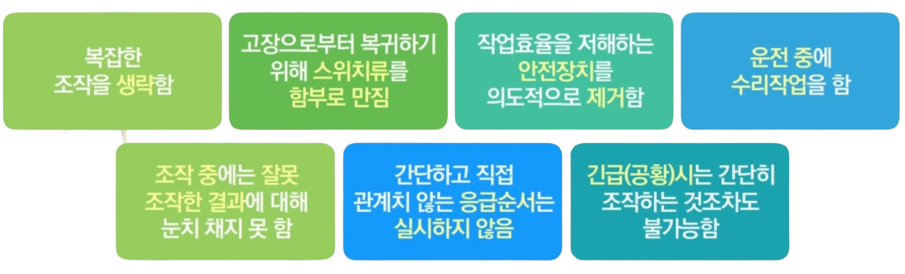

# 안전 관리 우수연구실 인증제의 이해
# 휴먼에러
## 휴먼에러의 이해
### 휴먼에러란?
- 허용범위를 벗어난 일련의 행동
- 시스템의 성능, 안전 또는 효율을 저하시키거나 감소시킬 잠재력을 갖고 있는 부적절하거나 원치 않는 인간의 결정이나 행동
### 인간의 실수 메커니즘
- 입력착오
	- 감각(Sensory) 혹은 지각(Perceptual) 입력의 착오
- 처리(의사결정)착오
	- 중재(Mediation) 혹은 정보처리 착오
- 출력착오
	- 신체적 반응 및 인간제어의 착오
### 인간의 정보처리 단계

### 잘못된 생각과 올바른 생각
#### 잘못된 생각
- 휴먼에러는 대개 공장 작업자의 부주의에 의해 발생한다.
- 에러는 우연히 발생하고, 그것들은 예견될 수 없는 경우가 대부분이다.
- 정의에 의하면 모든 에러는 나쁘다.
#### 올바른 생각
- 공정안전과 관련된 대부분의 에러는 적절한 관리에 의해 예방될 수 있다.
- 모든 에러는 예방 가능한 원인들로 구성되어 있다.(예견 가능)
- 결과가 발생하기 전에 대부분의 에러는 복구된다.

### 실패, 실수, 위반의 정의
#### 실패(mistake)
- 부적절한 계획결과로 인해 원래의 목적 수행 실패
#### 실수 또는 부주의(slips)
- 익숙한 환경에서 잘 훈련된 작업자에게 나타나는 특징
- 계획된 목적수행에 필요한 행위의 실행에 오류가 발생
#### 위반(violations)
- 개개인이 통상 규칙이나 절차를 따르지 않음
- 예상치 못한 돌발적 행동
- 위반은 고의적이고 때론 잘못 디자인 된 장비와 부적당한 절차서에 의해 발생할 수 있음

인간은 불연속적 직무와 관련한 직무에서 1000~10000번 마다 한 번 실수
하루 20000~100000 행위 즉, 하루 2회 이상 실수
휴먼에러는 80% 정도 감지됨
## 휴먼에러 예방방법
### 선발(Selection; Jop placement)
- 직무적성에 적합한 작업자를 선발해 적재적소에 배치
### 훈련(Training)
- 물질에 대한 이해, 보유상황, 사용되는 상태 등을 평가하는 세심한 주의를 전달할 수 있는 올바른 훈련 실시
### 동기부여 캠페인(Motivation Campaign)
- 현장에서의 휴먼에러는 조직 전체의 문제로 인식해야 함
- 휴먼에러에 대한 공동체 의식을 깨닫기 위해 함께 노력하는 자세와 동료에 대한 이해하는 마음을 가져야 함
### 작업자에게 맞는 작업환경
1. 중대한 사건 기술
	- 막연한 아차사고 분석
2. 시스템적 접근
	- 서브시스템 확인
	- 기능 할당(Man-machine System)
	- 의사결정 다이어그램 사용
	- 작업장의 모형 분석(Mock-ups)
3. 노출 감소
	- 낙하 물품
	- 걸려 넘어짐
	- 주사 바늘 제거
4. 작업자를 고려한 인간공학적 기기설비 디자인
	- 표시장치(Displays) 설계 제작
	- 조절장치(Controls) 디자인
	- 표시장치와 조절기장치의 레이아웃
### 신입자
- 신입자의 특성
	- 새로운 현장의 업무에 익숙치 못함
	- 정보를 입수해 취사선택하고 단기 기억한 것을 계획대로 이행하지 못하는 경향이 높음
	- 습관 형성이 안되어 어떻게 처리해야 안전한지 망설임
	- 확인하는 시간이 늦어 정해진 시간에 조작이 완료되지 않음
	- 서둘러 판단하므로 조작 혼란, 불필요한 긴장을 하게 됨
	- 정신적 피로가 높아 실수를 쉽게 범함
- 신입자가 범하기 쉬운 휴먼에러
	- 지각정보에 의한 취사선택이 생각대로 행해지지 않아 중요한 것 선택이 쉽지 않음
	- 새로운 정보를 쉽게 기억하고 활용하는 여유가 없음
	- 기억량이 적고 확실치 않아 기억하고 있는 것이 바로 생각나지 않음
	- 결심이 뒤따르지 않아 자신 없음
	- 중요한 것에서 초점이 흐려짐
	- 최악 상태로 되었을 때 겨우 눈치 챔
	- 여유가 없고 정신적 긴장상태에 직접적 결함이 있음
### 숙련자
- 숙련자의 특성
	- 자신의 과잉, 요령에 익숙해서 오류를 범함
	- 몸에 익숙한 조작을 하게 될 때 기억하고 있는 것과 자신의 행동에 대한 것을 무의식적으로 의심치 않음
		- 기억이 생략되거나 중단되기도 함
		- 틀린 행동을 할 위험성 커짐
- 숙련자가 범하기 쉬운 휴먼에러
	- 같은 업무를 오랫동안 반복하고 있어 습관이 되어 있음
	- 업무내용을 잘 알고 있다고 생각해 억측하기 쉬움
	- 복잡하지만 가능하다고 생각하여 주의하지 않음
	- 그 동안 잘못이 적었으므로 실제 잘못된 것을 알아채지 못함
	- 빠른 작업이 가능하므로 조작에서 자주 생략이 발생됨
	- 장시간 작업이 가능하나 오랜 작업으로 의식 수준 낮아짐
	- 그 업무에만 흥미가 있고 다른 것에 흥미를 느끼는 시야가 좁아짐
### 기타 범하기 쉬운 휴먼에러

## 휴먼에러 예방사례
### 인간의 행동특성으로 인한 휴먼에러 예방법
- 작업의 에러방지
	- 모든 작업은 요령에 따라서 순서를 정하고 그 순서에 따라 실시하도록 사전 지도
	- 지시 명령/보고, 연락 상담을 정확히 행하고 인계시나 작업 전에 미팅을 통해 빠뜨리는 것이 생기지 않도록 반드시 재확인
	- 다른 운전원이나 협력회사 등과 관계를 가진 작업을 포함해서 각 공정의 확인/체크를 확실히 행해 판단 잘못 및 오조작이 생기지 않도록 조치
- 시설환경에 의한 에러방지
	- 기기, 밸브 등의 배치, 표시/표식류에 오인/오조작이 생기지 않도록 고려
	- 통신설비, 조명설비는 연휴 작업이나 정전 시 작업에도 지장을 주지 않도록 연구
- 응급조치 에러방지 대책
	- 지휘명령을 정확히 행하여 장치의 정지 조치나 방재활동, 피난, 관계자 이외 출입금지조치 등의 대응이 원활하도록 함
	- 긴급조치 순서, 조작밸브 등의 식별, 인터락 등을 고안해서 장치의 정지 조치가 확실히 행해지도록 함
- 교육훈련
	- 작업에 필요한 지식, 기능을 계획적으로 체득시키는 훈련 시스템을 만들어 조기에 운전원의 능력을 향상함
	- 위험에 대한 감수성, 예지 능력을 높이는 수단을 강구하고 예상되는 훈련을 반복
- 의식 켐페인
	- 조직전체의 안전방침을 명확히 함
	- 대표, 관리감독자가 솔선해서 준수하고 의식 계몽 활동을 전개함
### 작업표준화를 통한 휴먼에러 예방
- 작업 표준: 그 위치의 부여를 정확하게 하고 제정개폐가 이루어지는 승인 결재 기준을 정함
1. 작업형태별 분류 체계화 -> 목차 부여, 작업항목을 검색하기 쉽게 함
2. 흐름도 등을 그림으로 넣음 -> 구체적 순서에 따라 정량적으로 기재
3. 통일된 작업표준으로 작성 -> 안전보건대책에 틈이 생기지 않도록 함
4. 착용할 보호구 종류나 중요 부분 등에 유의할 사항, 과거의 "아차" 사례 or 사고사례 등 첨부 -> 작업의 안전성 높임
5. 필요한 곳에 산업안전보건규칙 기준 등 법이나 기타 작업표준, 기기 취급설명서 등과의 연관된 것을 명기함
6. 설비변경 시 및 정기적으로 전원에게 똑바로 보고 행하도록 함
7. 안전보건교육 계획을 수립해서 반복 교육을 철저히 함
### 정확한 업무인수인계를 통한 휴먼에러 예방
1. 인계 시 업무기록: 작업의 개시로부터 상황, 조치 종료 등에 대해 시간순서대로 기재해 이상 시 확인이 가능하도록 함
2. 직접교대 인계: 모두 만나서 실시하고 각 담당장치 운전원과 운전원간에 인계함
3. 중요한 작업, 작업중인 업무 인계: 안전에 대해서 기재한 내용과 같이 현장에서 작업상황을 확인하지 않으면 안됨
4. 쉬는 시간 이후 인계: 쉬는 동안에 경과상태도 함께 인계 실시
### 업묵대시 전 미팅을 통한 휴먼에러 예방
-  업무시작 시는 밝고 건강을 유지하도록 작업을 배려함
- 인계사항 확인 및 지시 연락함
- 업무항목, 업무순서, 역할분담, 안전확인을 함
- 업무 관련 아찔한 사고 or 위험성에 대해서 의논하고 안전요소 가운데 가장 중요한 것을 행동목표로 정해 전원이 공유함
- 업무시작 전 미팅 or 업무변경 등의 기록은 작업이 끝날 때까지 게시하여 전원이 업무도중에도 확인 가능토록 함
### 명확한 ㅇ럽무지시를 통한 휴멍에러 예방
- 지시 명령은 서식화된 지시명ㄹ형서 등에 발생 일시, 장소, 건명, 목적, 내용 등의 항목을 기재해 시행함: 구두 명령은 가능한 피함
- 비정상 작업의 작업지시 명령서는 작업지시자, 감독자, 운전원 등의 확인란을 만듦
- 지시명령서는 추상적인 표현은 피하고 지시 받는 사람의 오해가 생기지 않도록 써서 수치로 나타낸 것은 수치화함
- 지시사항 중 안전포인트를 기억함: 오랫동안 반복하는 작업은 감독자 자신도 안전확인을 수시로 행하도록 체크항목을 넣음
- 구두는 피하고 지시 전달을 메모함
### 업무공유를 통한 휴먼에러 예방법
-  업무에 관계있는 보고, 연락, 의논은 담당 및 책임구분이 되도록 명확하게 실행함
- 운전, 업무상의 변화는 어떤 작은 것이라도 보고, 의논해 지시의 철저를 도모함
- 시운전, 기기 보존 등의 비정상 작업은 미리 작성해서 순서에 따라 관계자와 면밀한 연락을 취하여 실시함
- 보전작업 등에 관계되는 관계자외의 보고, 연락, 의논은 문서 등으로 확인수단을 강구함
- 업무상 처치, 경과 및 결과는 적절한 기록을 취해 확실하게 인계를 행하고 책임자 등에 보고하여 확인을 얻음
- 체험, "아차" 사고 경험 등은 양식화된 보고서로 기재해 제출하고 수평 전개를 하는 것도 검토회의를 통해 해결을 도모함
# 전기 안전관리 기초
# 기계 안전관리
# 연구활동종사자 안전관리 활동
# 연구실 주요 기기, 장비 취급관리 가이드
