| 성능 평가 지표           | 설명                                                                                                                                           |
| ------------------ | -------------------------------------------------------------------------------------------------------------------------------------------- |
| Adjusted R-Squared | - 결정 계수, 회귀 모델이 주어진 데이터에 얼마나 적합한 지 평가 - 예측 대상 변수 y의 변동량 대비 모델 예측 값의 변동량 의미 - 0~1 사이의 값이며 상관 관계가 높을수록 1에 가까움 - 0.5 이상이면 적합성이 좋다고 판단함 |
| MAE                | - 평균 절대 오차이며 모든 절대 오차의 평균     - 절대 오차: 실제 값과 예측 값의 차이 - 예측 대상 변수의 단위 고려 필요                                                             |
| MSE                | - 평균 제곱 오차이며 오차의 제곱에 대한 평균 - 통계적 추정의 정확성에 대한 질적인 척도 - 수치가 작을수록 정확성이 높다고 판단.                                                            |

## 2022
### AI 모델 구축
- 모델 교차 검증을 위한 K-Fold 방식 적용
	- 모델 학습 시 학습 및 검증용 데이터를 10개 폴드로 나누어 교차검증(10-fold Cross Validation)
	- 폴드가 변경되며 반복 수행되므로 모델 성능에서 우연성을 배제할 수 있음
	- 학습 데이터와 검증 데이터를 변경하며 반복하여 학습을 진행하므로 과적합을 방지할 수 있음
- 생분해성 섬유 물성 예측 모델 성능 개선을 위한 추가 데이터 확보
	- 물성 예측 모델 정확도 개선을 위한 추가 데이터 확보
		- 주요 방사 공정 변수들의 분포가 적은 범위 구간을 대상으로 수행
 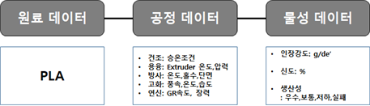
#### 주요 공정 변수 별 데이터 분포 현황

| Tenacity(강도)         | 범위       | 단위  | 주 분포 구간  | 미흡 구간              |
| -------------------- | -------- | --- | -------- | ------------------ |
| 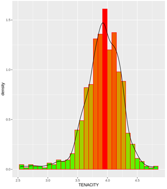 | 2.5\~5.0 | 0.1 | 3.5\~4.3 | 2.5\~3.5, 4.3\~5.0 |

| Elongation(신도)       | 범위     | 단위  | 주 분포 구간 | 미흡 구간          |
| -------------------- | ------ | --- | ------- | -------------- |
| 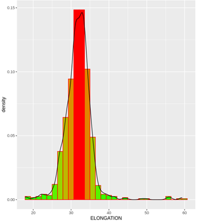 | 15\~60 | 1   | 28\~37  | 15\~28, 37\~60 |

| Spinbeam Temperature(스핀빔 온도) | 범위       | 주 분포 구간 | 미흡 구간              |
| ---------------------------- | -------- | ------- | ------------------ |
|      | 250\~268 | 258     | 250\~257, 259\~268 |

| Manifold Temperature(매니폴드 온도) | 범위       | 주 분포 구간 | 미흡 구간              |
| ----------------------------- | -------- | ------- | ------------------ |
| 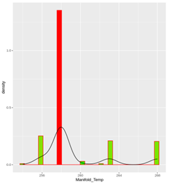          | 250\~268 | 258     | 250\~257, 259\~268 |

| Godet Roller 1 Speed(GR 1 속도) | 범위         | 주 분포 구간    | 미흡 구간                  |
| ----------------------------- | ---------- | ---------- | ---------------------- |
| 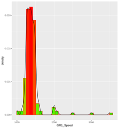          | 1000\~3500 | 1200\~1500 | 1000\~1199, 1501\~3500 |

| Godet Roller 1 Temperature(GR 1 온도) | 범위     | 주 분포 구간 | 미흡 구간        |
| ----------------------------------- | ------ | ------- | ------------ |
| 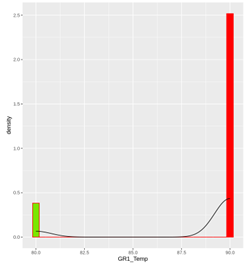                | 80, 90 | 90      | 90 외 실제 사용구간 |

| Godet Roller 2 Speed(GR 2 속도) | 범위         | 주 분포 구간    | 미흡 구간                  |
| ----------------------------- | ---------- | ---------- | ---------------------- |
| 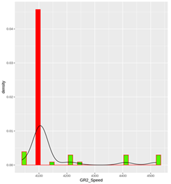          | 1000\~3500 | 1200\~1500 | 1000\~1199, 1501\~3500 |

| Godet Roller 2 Temperature(GR 2 온도) | 범위     | 주 분포 구간 | 미흡 구간        |
| ----------------------------------- | ------ | ------- | ------------ |
| 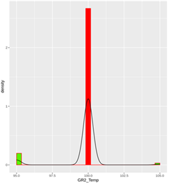                | 80, 90 | 90      | 90 외 실제 사용구간 |

| DR(연신비)              | 범위       | 주 분포 구간  | 미흡 구간              |
| -------------------- | -------- | -------- | ------------------ |
| 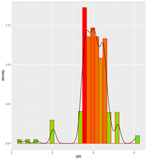 | 1.2\~4.1 | 2.7\~3.3 | 1.2\~2.6, 3.4\~4.1 |

| Winder Speed(F/R 속도) | 범위         | 주 분포 구간 | 미흡 구간      |
| -------------------- | ---------- | ------- | ---------- |
| 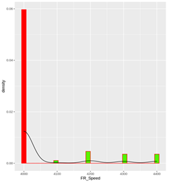 | 4000\~4400 | 4000    | 4001\~4400 |

#### 주요 공정 변수 별 데이터 불균형 정도

| 구분  | SB_T | MF_T | GR1_S | GR1_T | GR2_S | GR2_T | FR_S |
| --- | ---- | ---- | ----- | ----- | ----- | ----- | ---- |
| 다수  | 0.65 | 0.65 | 0.88  | 0.87  | 0.76  | 0.92  | 0.82 |
| 소수  | 0.35 | 0.35 | 0.12  | 0.13  | 0.24  | 0.08  | 0.18 |
Spinbeam과 Manifold Temperature를 제외한 나머지 변수들은 데이터 분포 불균형이 확인됨
1. 주로 사용하는 특정 공법 위주의 방사 공정 변수 구간 설정
2. 많은 시간과 비용이 필요한 방사 특성으로 인해 특정 변수 및 범위 구간에 대해 우선 수집한 결과
3. 데이터 분포가 적은 구간의 방사 실패율 고려

| 주요 방사 공정 변수                | 미흡 구간      | 주 분포 구간    | 미흡 구간      |
| -------------------------- | ---------- | ---------- | ---------- |
| Spinbeam Temperature       | 250\~257   | 258        | 259\~269   |
| Manifold Temperature       | 250\~257   | 258        | 259\~269   |
| Godet Roller 1 Speed       | 1000\~1199 | 1200\~1500 | 1501\~3500 |
| Godet Roller 1 Temperature | -          | 90         | -          |
| Godet Roller 2 Speed       | 4000\~4099 | 4100       | 4101\~4520 |
| Godet Roller 2 Temperature | 95\~99     | 100        | 101\~105   |
| DR                         | 1.2\~2.6   | 2.7\~3.3   | 3.4\~4.1   |
| Final Roller Speed         | -          | 4000       | 4001\~4400 |
- 데이터 불균형을 해소할 수 있는 균형적인 방사 공정 데이터 수집안 제시
	1. 현재 데이터 분포 참고해 방사 실패율 높은 구간을 제외하여 방사 공정 변수 범위를 수정
	2. 수정된 방사 공정 범위에서 데이터 분포를 확인해 데이터 부족 구간에 대해 추가 확보
	3. 각 공정 변수 구간 단위 정하고 각 단위별로 최대한 균형 있게 계획하여 수집
	4. 유의미한 방사 성공이 가능한 구간에 대해서 서비스 제공할 수 있는 모델 개발
- 주요 방사 공정 변수와 생산성 간 관계 분석
	- 전체 1,172 중 성공 816, 실패 356건
	- 생산성에 영향을 주는 것은 주로 Godet Roller와 관련된 연신 과정으로 확인됨
#### 생분해성 섬유 물성별 핵심 공정 변수 확립
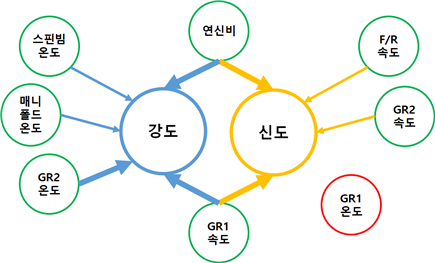
#### 비정상적인 생분해성 섬유 물성 데이터 분석 및 처리
- 비정상 데이터가 포함된 구간의 예측 오차 증대
	- 예측 모델의 과적합 발생 가능
	- 방사 공정 데이터 샘플 간 오차 발생
		- 한 번의 방사 테스트에서 여러 개의 샘플을 체취하고 물성 분석 수행
		- 물성 분석 결과 각 샘플 간 오차 존재
		- 샘플 간 오차가 발생에는 다양한 원인 존재
- 비정상적인 데이터의 발생 원인
	- 방사 공정 결과 샘플의 수집 방법과 시기 차이
	- 물성 분석을 위한 각 샘플 채취 시 대상이 되는 부분 차이
	- 생분해성 섬유 소재의 물성 분석 환경에 따른 자체 오차
	- 물성 분석에 활용하는 도구, 물성 분석자 차이로 발생
	- 물성 분석 과정에서 분석자의 실수, 분석 결과 오기입
- 데이터 이상치 판단 및 처리를 위한 허용 오차 기준이 필요
	- 방사 공정 물성들에 대한 관리 한계 ± 허용치 참고

| 구분 항목    | 종전공정관리한계  | 공정관리한계   |
| -------- | --------- | -------- |
| DE'      | 72.5±2.0  | 72.5±2.0 |
| TE(g/DE) | 4.60±0.30 | 4.7±0.30 |
| EL(%)    | 32.5±3.5  | 31.5±3.5 |
- 공정관리한계 허용치를 고려했을 때 허용 가능한 오차 수치
	- TE: 0.6, EL: 7.0
- 생분해성 섬유 방사 공정 데이터 판단 기준 확립과 이상치 처리 알고리즘 구현
	- 비정상적 데이터 발생 원인과 허용 오차를 고려한 판단 기준 확립
		- 동일 방사 조건 하 최대 4개 샘플 수칩 시 샘플 간 오차
	- 동일한 방사 조건에서 발생한 최대 4개 샘플 군집에 대한 각 물성 수치들의 평균값에서 표본집단을 고려하여 공정관리한계 허용치보다 한 단위 더 넓게 설정
		- 데이터 이상치로써 제거하나 데이터 추가 수집에 따라 다시 포함될 수 있음
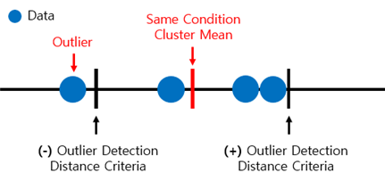
- 데이터 불균형을 해결하기 위해 우선 순위 높은 GR1_Speed와 DR, DR의 경우 GR1_Speed 증강에 따라 같이 증강되므로 GR1_Speed의 소수 구간 데이터를 4배 증강시켜 데이터 분포 불균형을 개선
	- 기본 데이터와 이상치 제거 데이터의 모델 성능은 비슷함
	- 증강한 데이터의 경우 모델이 데이터 분포 미흡 구간에 더 잘 적합해 Adjusted $R^2$ 수치가 10~20% 상승
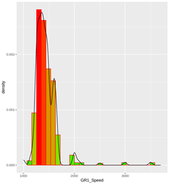
 
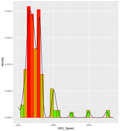

#### 기 구축 물성 예측 모델 완성도 보안을 위한 고도화
- 예측 모델 정확도 향상을 위해 딥러닝 Multi-Layer Perception 모델 및 증강 데이터 기준으로 물성 예측 모델 별 활용 변수 비교
- 강도 예측 모델 학습 시 GR1_Temp, GR2_Speed, FR_Speed는 영향 없으므로 제외했을 경우 성능이 비슷하나 미세하게 떨어져 8개 변수 모두 다 사용하는 것이 적절하다고 판단됨

### 2022년 총 정리
- 균형적인 데이터 수집안을 통한 데이터 불균형 해소
- 예측 물성별 핵심 공정 변수 확립
- 허용 오차를 활용한 데이터 이상치 처리 알고리즘 구현
- 물성 상관성과 데이터 불균형을 고려한 우선순위 기반 데이터 증강
- 모델 고도화 및 성능 목표 달성
- 논문: 데이터 불균형과 측정 오차를 고려한 생분해성 섬유 인장강신도 예측 모델 개발
## 2023
### AI 모델 구축
#### 고강도 생분해성 섬유(PLA) 개발
- 다양한 방사 공정 변수들의 모든 범위를 고려한 방사 데이터 수집 불가능
- 축적된 방사 데이터로 물성 예측 AI 모델을 학습 및 고도화
- 데이터 기반 물성 예측 AI 모델을 활용해 수집하지 못한 방사 영역의 예측 결과를 통해 고강도 생분해성 섬유 개발이 가능한 방사 공정 레시피 탐색

| 구분     | 2022                                         | 2023                                         |
| ------ | -------------------------------------------- | -------------------------------------------- |
| 학습 데이터 | 총 969셋 공정 변수 8개, 물성 변수 2개                 | 총 1,525셋 공정 변수 8개, 물성 변수 10개              |
| 문제 구분  | Regression                                   | Regression                                   |
| 적용 모델  | 물성 예측 딥러닝 MLP Model                          | 물성별 최고 성능 머신러닝 앙상블 Model                     |
| 예측 정확도 | MAE: TA-0.14 EL-1.80 MSE: TA-0.03 EL-6.09 | MAE: TA-0.12 EL-1.37MSE: TA-0.03 EL-3.05 |
| 정확도 기준 | 공정관리한계 허용오차 기준 유효성 검증 수준: 80%             | 공정관리한계 허용오차 기준 유효성 검증 수준: 85%             |
- 미수집 방사 공정 영역에 대한 시뮬레이션 예측을 최대한 상세히 수행
	- 방사 공정 변수별 Offset을 최소화 해 가능한 많은 경우의 수 고려
- 물성 예측 AI 모델들을 활용한 방사 공정 시뮬레이션 결과 도출

| 물성       | 수집 최솟값 | 시뮬레이션 최솟값 | 수집 최댓값 | 시뮬레이션 최댓값 |
| -------- | ------ | --------- | ------ | --------- |
| 인장강도     | 3.0    | 3.3       | 4.8    | 4.5       |
| 인장신도     | 20     | 20        | 41     | 40        |
| 열응력-평균온도 | 77     | 80        | 139    | 120       |
| 열응력-평균강도 | 3.7    | 4.0       | 22.1   | 22.0      |
| 사불균제도    | 1.8    | 1.9       | 6.2    | 5.3       |
| 번수       | 34.6   | 35.0      | 36.5   | 36.5      |
| 고분자 결정화도 | 25     | 28        | 100    | 88        |
| 열분해온도    | 280    | 295       | 393    | 360       |
| 용융온도     | 132    | 135       | 175    | 170       |
| 유리전이온도   | 43     | 45        | 71     | 65        |

| 구 분             | 스핀빔 온도 | 매니폴드 온도 | 고뎃롤러 1 속도 | 고뎃롤러1 온도 | 고뎃롤러2 속도 | 고뎃롤러 2 온도 | 연신비   | 권취 속도 |
| --------------- | ------ | ------- | --------- | -------- | -------- | --------- | ----- | ----- |
| 인장강도            | -0.26  | -0.05   | -0.13     | 0.06     | -0.27    | -0.24     | 0.02  | -0.29 |
| 인장신도            | 0.30   | 0.30    | -0.36     | 0.04     | 0.43     | 0.80      | 0.45  | 0.26  |
| 열응력 평균강도 | -0.05  | -       | 0         | -        | -0.65    | -0.78     | -0.32 | -0.64 |
| 열응력 평균온도 | 0.75   | -       | -0.67     | -        | 0.22     | 0.28      | 0.71  | 0.13  |
| 사불균 제도     | -0.70  | -       | 0.62      | -        | 0.28     | 0.21      | -0.41 | 0.37  |
| 번수              | -0.78  | -       | 0.71      | -        | 0.22     | 0.24      | -0.52 | 0.32  |
| 고분자 결정화도        | 0.54   | -       | -0.33     | -        | 0.14     | 0.37      | 0.36  | 0.09  |
| 열분해 온도     | 0.16   | -       | 0.04      | -        | 0.07     | -0.09     | -0.01 | 0.06  |
| 용융온도            | 0.14   | -       | -0.07     | -        | -0.52    | -0.44     | -0.19 | -0.52 |
| 유리전이 온도         | 0.07   | -       | -0.11     | -        | -0.12    | -0.17     | 0.03  | -0.14 |
- 이상치 처리 알고리즘 확장
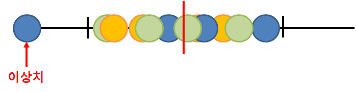

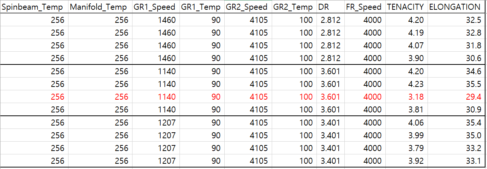

## 2024
++ 프로젝트 1에서 모델 블렌딩을 사용하였는데 이는 넓은 의미에서는 Stacking Ensemble과 동일해 보이나 좁은 의미에서는 다르다.
