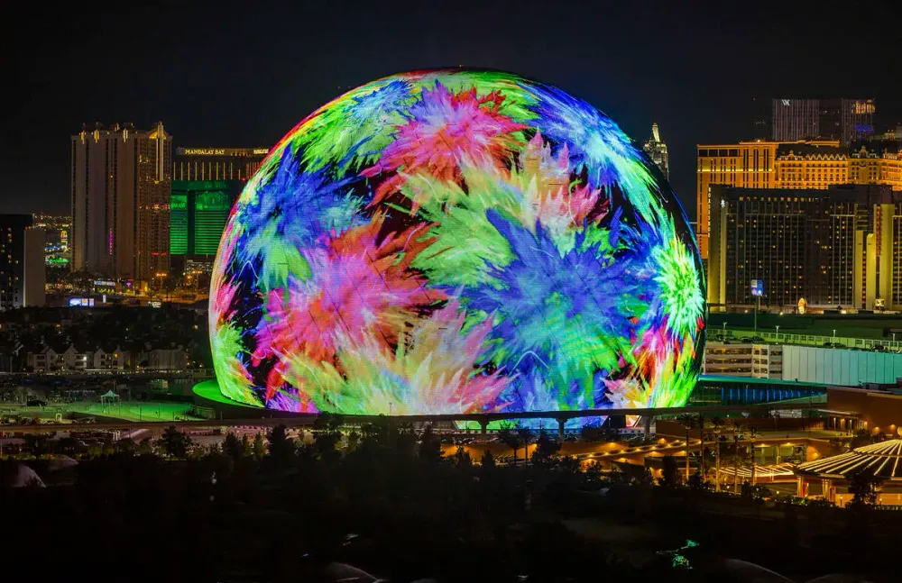

# 자료 수집
## Wellness
### Global Wellness Insitute

## Benchmarking
###
### H/W
#### [Sphere](https://www.thesphere.com/)
이 프로젝트를 보자마자 생각났던 건 미국 라스베이거스의 Sphere였다.

Sphere는 반구형 공연장으로, 외벽이 전부 미디어 파사드로 덮혀 있다는 특이점이 있다.
내가 컨텐츠 관련으로 아이디어를 제시할 일이 없겠지만, 계약서를 작성할 때 참고할 수 있을 거 같아 기입했다.
#### [Looxid Labs](https://looxidlabs.com/)
뇌파 탐지 디바이스인 Link Band를 필두로 다양한 솔루션을 전개한다.
뇌파 기반 명상 클래스 서비스인 Mind Breeze, B2C/B2B 집중 습관 형성 솔루션 Focus Mate 등을 운영 중이다.

접근 방식은 개인이 디바이스를 착용하여 뇌파 탐지를 통한 상태 인지 및 개선 방향 제공으로 보인다.
현재 프로젝트와 큰 방향성은 같으나 하드웨어적인 측면이 많이 다르나, 같은 디지털 웰니스 영역에 포함되어 기입했다.
### S/W
#### [Calm](https://www.calm.com/)
세계 1위 수면, 명상, 휴식 부문 어플리케이션 Calm이 스트레스 및 불안, 마음챙김으로 확장하였다.
#### [Alchera](https://www.alchera.ai/)

아직 Device에 대한 확정은 없으나 과하게 정보를 많이 인식해 무거울 것으로 추측한다.
현재 필요한 기능은 얼굴 랜드마크 인식과 감정 유추에 불과하기에 벤치마크 삼으나 경량화에 초점을 두기에 기입한다.
